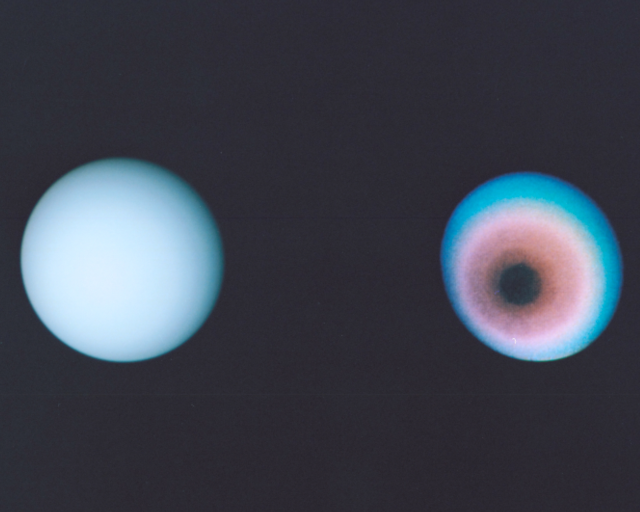
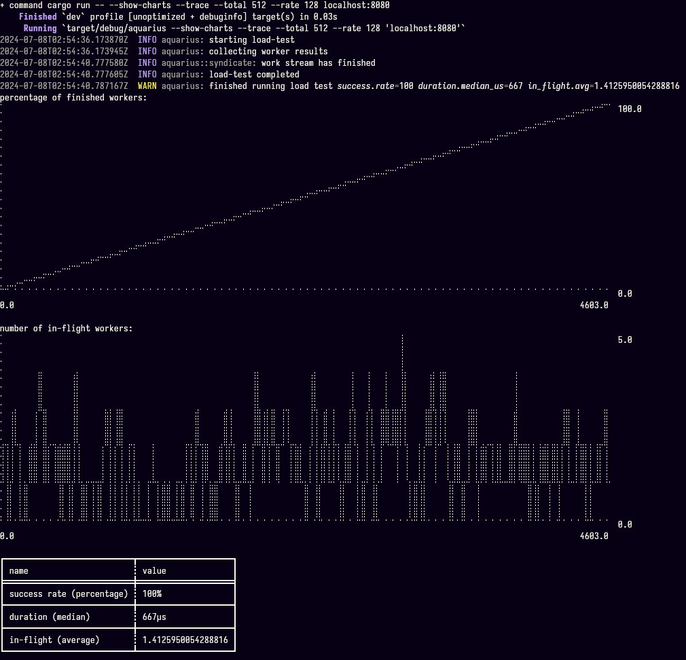

## ♒ aquarius

`aquarius` is a tool for load-testing http/2 servers.



### 🏃 running instructions

#### 🐚 shell script

the easiest way to see this program run is via the demo script. run it via:

```sh
; ./run.sh
```

#### 🤖 just

a [justfile][just] is provided, with commands to run a test server and run a
load test against that local server. you can choose from other actions via
fzf by running `just`, with no arguments.

**starting a local server**

```
; just run-test-server
```

**running a load-test against the server**

```
; just run-load-test
```

you may also use `cargo run` to run the aquarius binary.

```
; cargo run -- --rate 64 --total 1024 localhost:8080
```

**open library documentation**

```
just doc-open
```

#### 🤓 nix shell

nix users can run `nix develop` to enter a development shell that compiles the
`aquarius` binary and adds it to the $PATH. otherwise, `cargo build` will
suffice.

```
; nix develop

[user@host:~/aquarius]$ aquarius --help
aquarius: a lightweight http/2 load-tester

  __ _ __ _ _  _ __ _ _ _(_)_  _ ___
 / _` / _` | || / _` | '_| | || (_-<
 \__,_\__, |\_,_\__,_|_| |_|\_,_/__/
         |_|                     

Usage: aquarius [OPTIONS] <SERVER>

Arguments:
  <SERVER>
          the address of the server to be load-tested.
          
          this should be provided in the form of a `hostname:port` pair.

Options:
      --total <REQUESTS_TOTAL>
          the number of requests to send to the server

      --rate <REQUESTS_PER_SECOND>
          the rate at which to send requests to the server

      --show-charts
          if true, render ascii charts after finishing

      --trace
          if true, configure a [`tracing`] subscriber.
          
          these logs will be written to stdout.

  -h, --help
          Print help (see a summary with '-h')
```

#### 💹 rendering charts

if the `--show-charts` option is provided, some ascii charts will also be
rendered. by default, this is false.



#### 🔬 `tracing` logs

`aquarius` will emit tracing logs on stderr if the `--trace` option is
provided. by default, this is false.

### ❗ usage disclaimer

orienting a load-tester at infrastructure you do not control can be considered
a denial-of-service (DoS) attack. be sure to point `aquarius` at your own
servers.

---

### 🔗 colophon

the banner image is a composite of two photographs taken by Voyager 2, showing
the pole rotation of Uranus. this image can be found in the public domain
via the [internet archive][ac86-7003].


[ac86-7003]: https://archive.org/details/AILS-AC86-7003
[just]: github.com/casey/just
